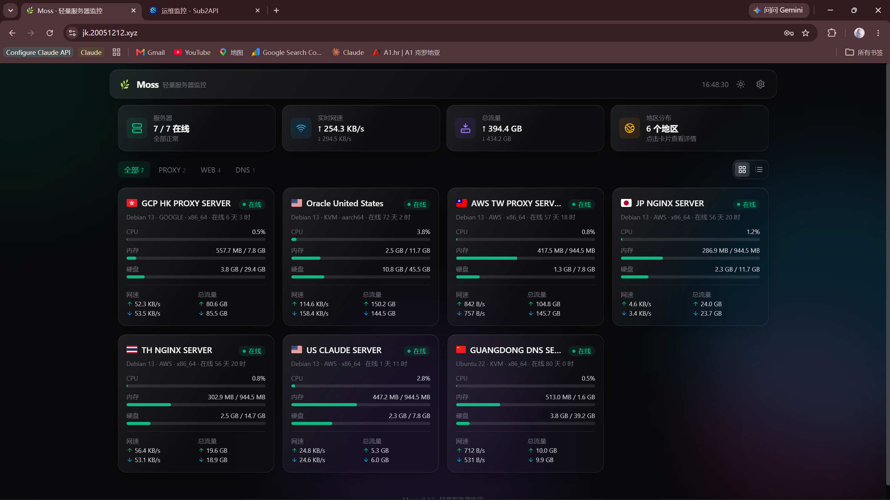
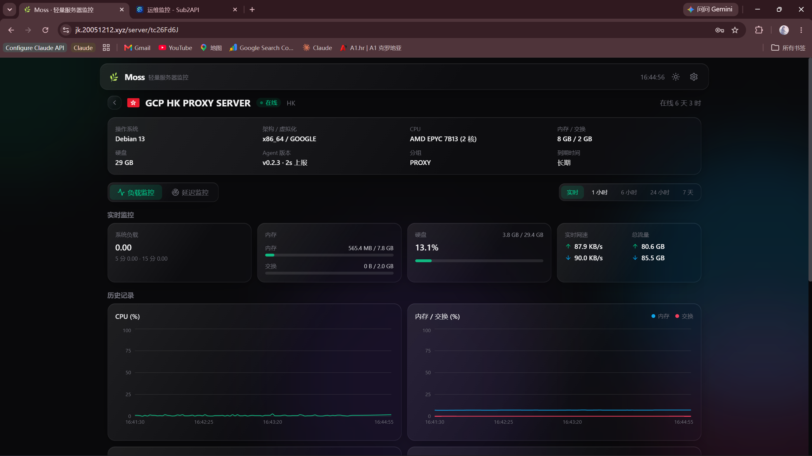
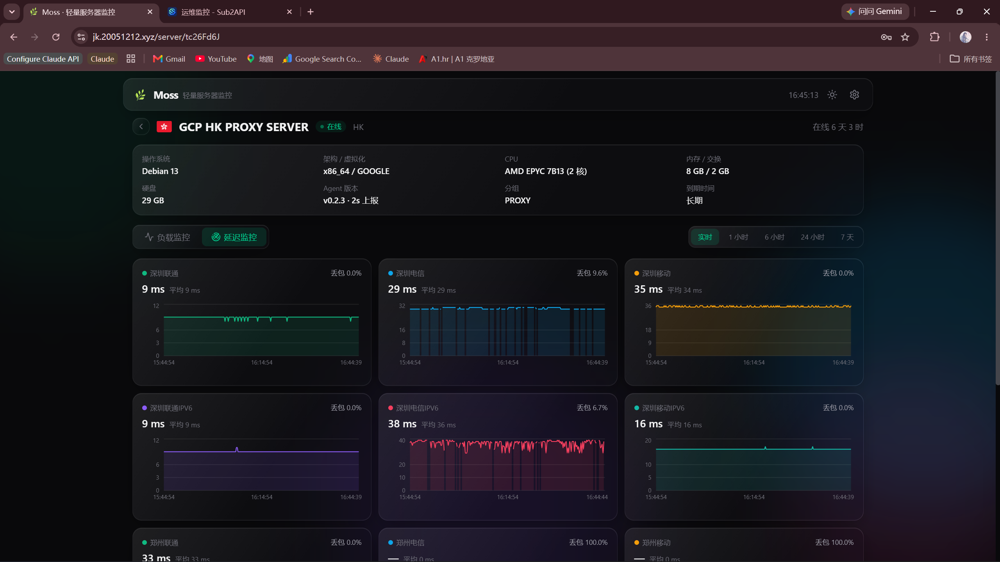

# Moss

> A lightweight, self-hosted server monitor — single binary, embedded frontend, SQLite storage. No MySQL/Redis, up and running in 5 minutes. It does the few things you actually need, without feature bloat.

<p>
  <a href="https://github.com/J606y/moss/stargazers"></a>
  <a href="https://github.com/J606y/moss/releases"></a>
  <a href="./LICENSE"></a>
  
  <a href="https://ghcr.io/j606y/moss"></a>
</p>

**🔗 [Live Demo](https://jk.20051212.xyz)** · **📖 [中文 README](./README.md)**



---

## ✨ Features

- 📊 **Overview** — card / list dual view: CPU, memory, disk, live network speed and traffic at a glance
- 📈 **Realtime** — WebSocket push (2s by default), live-scrolling charts, smooth per-digit network-speed counter
- 🕐 **History** — hours-to-days of load history, second-level adjustable sampling, stored in SQLite
- 🛰️ **Probes** — ICMP / TCP / HTTP probe tasks, latency curves + packet loss
- 🔔 **Alerts** — offline / load-threshold / network-speed-threshold alerts and server expiry reminders via Telegram (with recovery notices)
- ⚙️ **Admin** — drag-to-reorder servers and probe tasks, one-click install commands, single-admin password login
- 🚀 **Dead-simple deploy** — server single binary (frontend embedded) + agent single binary, works on Linux / macOS / Windows

> Deliberately out of scope: OAuth / 2FA / multi-user, WebSSH, theme marketplace, i18n. Stay light, stay simple.

## 📸 Screenshots

| Load monitoring · live metrics & history | Latency probes · ICMP/TCP/HTTP |
| :---: | :---: |
|  |  |

## 🤔 Why Moss?

There's no shortage of self-hosted monitors (Nezha, Komari and others are great). Moss makes a clear set of trade-offs:

- **Zero external dependencies** — the backend uses Go + the pure-Go `modernc` SQLite driver, so storage is just a file. No separate MySQL / Redis. Comfortable even on a 1 vCPU / 512 MB box.
- **Single-file delivery** — `moss-server` embeds the built frontend; run `./moss-server` and you're done. Prefer not to fuss? There's a Docker image and a one-line installer too.
- **Just enough** — only server monitoring + latency probes + alerts. Clean UI, few knobs, works out of the box.

Great for: anyone with a handful to a dozen VPSes who wants a good-looking, low-maintenance dashboard and doesn't need enterprise multi-tenancy.

## 🚀 Quick Start

### server (Docker, recommended)

**Easiest — one-line script** (menu-driven install / update / uninstall, auto-generates and prints the admin password):

```bash
bash <(curl -fsSL https://raw.githubusercontent.com/J606y/moss/main/deploy/moss.sh)
```

Then open `http://<server-ip>:8787`. The script also installs a global `moss` command — from then on just type `moss` on the server to reopen the management menu (install / update / uninstall / status & password / logs / switch listen address), no need to remember the curl line.

Equivalent manual options:

```bash
# Option A: prebuilt image (available once published to GitHub Release / GHCR)
mkdir -p moss && cd moss
curl -fsSL -o docker-compose.yml https://raw.githubusercontent.com/J606y/moss/main/deploy/docker-compose.yml
echo 'MOSS_ADMIN_PASSWORD=your-strong-password' > .env   # only used on first init
docker compose up -d

# Option B: build from source
git clone https://github.com/J606y/moss.git && cd moss/deploy
echo 'MOSS_ADMIN_PASSWORD=your-strong-password' > .env
docker compose up -d --build
```

Or a single `docker run`:

```bash
docker run -d --name moss -p 8787:8787 \
  -e MOSS_ADMIN_PASSWORD=your-strong-password \
  -v moss-data:/app/data \
  ghcr.io/j606y/moss:latest
```

The database lives in the named volume `moss-data` (`/app/data` is owned by nonroot inside the image, no manual chown needed). Open `http://<server-ip>:8787`.

> Releases also ship self-contained `moss-server-*` binaries (frontend embedded) — run `./moss-server-linux-amd64 --data ./data` directly, no Docker required.

### Reverse proxy + TLS (Nginx, optional but recommended for production)

Put Nginx in front to terminate TLS and serve HTTPS / wss. First run the Moss container **bound to loopback with `--trust-proxy`** (`-p 127.0.0.1:8787:8787` plus the `--trust-proxy` flag — reads the real client IP and enables Secure cookies under HTTPS), then reverse-proxy to `http://127.0.0.1:8787`.

> **Rate limiting + login lockout (on by default)**: Moss rate-limits `/api` per real client IP (default **600**/IP/min), with a stricter limit on sensitive endpoints like login (default **10**/IP/min, plus per-IP lockout on failed logins); over the limit returns `429`. Tune via env vars `MOSS_RATELIMIT_PER_MIN` / `MOSS_RATELIMIT_AUTH_PER_MIN`, set `0` to disable a layer.
>
> **Identifying the real client IP (security)**: `--trust-proxy` is required to read `X-Forwarded-For` (otherwise the socket peer IP is used — which under multi-layer proxying is the origin Nginx's IP, lumping all visitors into one bucket). Each Nginx layer **appends** with `$proxy_add_x_forwarded_for`, and Moss **no longer trusts the left-most XFF entry** (the client can forge it and bypass rate limiting / login lockout). Instead it walks XFF **right-to-left** and returns the first address not in your trusted-proxy list:
> - **Single layer** (one Nginx directly in front of Moss): no extra config — Moss takes the right-most XFF entry (the peer IP that this Nginx appended, which clients can't forge).
> - **Multi-layer** (visitor → edge Nginx → origin Nginx → Moss): list your own edge nodes' public IPs via `--trusted-proxies` (comma-separated CIDRs or bare IPs, e.g. `--trusted-proxies 203.0.113.10,198.51.100.0/24`). Moss skips listed and loopback addresses from the right, and the first non-trusted address is the real client; the attacker-forged left-most segment can't reach that position.

**Easy path — the [`nginx-rp`](https://github.com/J606y/nginx-rp) one-liner** (auto-installs Nginx + acme.sh, issues and auto-renews certs; supports HTTP-01 / DNS API / wildcard):

```bash
bash <(curl -fsSL https://raw.githubusercontent.com/J606y/nginx-rp/main/nginx-rp.sh)
```

When prompted: set the **upstream target** to `http://127.0.0.1:8787`, **choose cache mode "none"** (Moss manages its own caching — "normal" / "slice" caching will pin stale HTML after an upgrade), then follow the guide for the domain and cert method. The generated config already ships the WebSocket upgrade headers, so `/api/ws` and `/api/agent/ws` (live charts + agent reporting) work out of the box.

**Prefer to configure by hand** → see [`deploy/nginx.example.conf`](deploy/nginx.example.conf): a complete Moss-tailored example. The essentials are the WebSocket upgrade headers on `location /`, passing `X-Forwarded-Proto`, and **never caching HTML**.

### agent (install script)

On each monitored host, install the agent with the `mk_` token from "Add server" in the admin panel:

```bash
# Linux / macOS
curl -fsSL https://<your-moss>/install.sh | bash -s -- --endpoint https://<your-moss> --token mk_xxx
```

```powershell
# Windows (admin PowerShell)
powershell -ExecutionPolicy Bypass -Command "& ([scriptblock]::Create((iwr -useb https://<your-moss>/install.ps1))) -Endpoint 'https://<your-moss>' -Token 'mk_xxx'"
```

The script downloads the matching agent binary from GitHub Release (`J606y/moss`) and registers it as an auto-start service (systemd / launchd / Scheduled Task).

> ICMP probes need admin on Windows / root or `CAP_NET_RAW` on Linux; TCP / HTTP probes don't.

## 🏗 Architecture

```
moss/
├── web/       # Frontend: React + TS + Tailwind + Recharts
├── server/    # Backend: Go + SQLite (pure-Go modernc driver), embedded frontend, single binary
├── agent/     # Agent: Go + gopsutil, single binary, reports over WebSocket
├── internal/  # Protocol types shared by server / agent
└── deploy/    # Dockerfile + docker-compose + nginx example + one-line script moss.sh
```

- The agent connects via `ws(s)://<server>/api/agent/ws?token=mk_xxx` and reports system metrics and probe results. Connection info is identical across Windows / Linux / macOS — only the install command differs (`install.sh` / `install.ps1`).
- Browsers subscribe to realtime push over `/api/ws`; historical data is aggregated into storage by the sampling interval.

## 🛠 Local Development

```powershell
# 1. Build the frontend (server serves web/dist)
cd web; npm install; npm run build

# 2. Build and start the server (prints a random admin password on first run, or set it via env var)
cd ..
go build -o bin/moss-server.exe ./server
$env:MOSS_ADMIN_PASSWORD='your-password'
.\bin\moss-server.exe --listen :8787 --data .\data --web .\web\dist

# 3. Log in at http://localhost:8787, add a server in the admin panel, grab the token, start a local agent
go build -o bin/moss-agent.exe ./agent
.\bin\moss-agent.exe --endpoint http://localhost:8787 --token mk_xxx
```

Frontend hot reload: `cd web; npm run dev` (Vite proxies `/api` to `localhost:8787`; open http://localhost:5173).

## 🗺 Roadmap & Status

All core features are live and running in production: server monitoring, latency probes, Telegram alerts, Docker / one-line deploy, Nginx reverse proxy + TLS/wss. See the [CHANGELOG](./CHANGELOG.md) for details.

Issues / PRs / Stars ⭐ welcome — if you find it useful, a star is the best encouragement.

## 📄 License

[MIT](./LICENSE) © j606y
